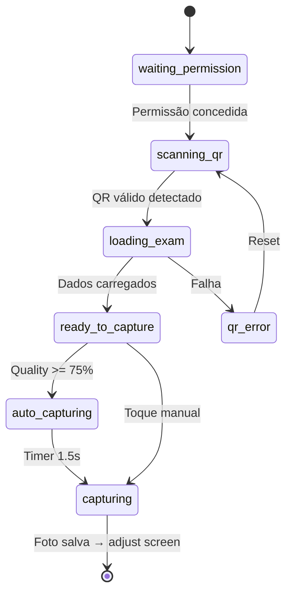

# Walkthrough — Gabarito Essential + Modos de Leitura + Config Hierárquica

## Resumo Final

Implementei todas as **7 fases** do plano de implementação, criando **37 arquivos** entre Platform e Duoscanner:

- **Platform (Laravel)**: 5 migrations, 2 seeders, 4 models, 3 services, 2 controllers, 3 views Blade, rotas web + API v2
- **Duoscanner (React Native)**: 1 database layer, 2 config modules, 4 scan components, 3 engine modules, 1 sync manager, atualizações em types/stores/screens

---

## Fase 6 — Duoscanner UI (Mobile)

### Novos Componentes de Scan

| Arquivo | Descrição |
|---------|-----------|
| [CaptureOverlay.tsx](file:///D:/.dev/avaliation_on/duoscanner/src/components/scan/CaptureOverlay.tsx) | Overlay animado com corner guides (cor = qualidade), 5 dots de qualidade (bordas/marcadores/foco/tilt/luz), barra de score, badge de auto-capture |
| [ScanModeIndicator.tsx](file:///D:/.dev/avaliation_on/duoscanner/src/components/scan/ScanModeIndicator.tsx) | Pills compactos mostrando modo ativo (hybrid/preloaded/qr), tipo de gabarito, status online/offline, estratégia de dados |
| [GuidanceOverlay.tsx](file:///D:/.dev/avaliation_on/duoscanner/src/components/scan/GuidanceOverlay.tsx) | Mensagens de orientação em tempo real do capture engine; fica verde quando qualidade >= 75% |
| [CorrectionSummaryCard.tsx](file:///D:/.dev/avaliation_on/duoscanner/src/components/scan/CorrectionSummaryCard.tsx) | Card de resultado com stat blocks (acertos/erros/branco/revisar), score grande com badge de porcentagem |

### Telas Redesenhadas

| Tela | Mudanças |
|------|----------|
| [camera.tsx](file:///D:/.dev/avaliation_on/duoscanner/app/scan/camera.tsx) | **Reescrita completa**: 8 estados (waiting_permission → scanning_qr → loading_exam → qr_error → version_conflict → ready_to_capture → auto_capturing → capturing), integração com config-resolver para estratégia de dados, auto-capture baseada em qualidade, fallback híbrido para QR dados, detecção de conflito de versão |
| [result.tsx](file:///D:/.dev/avaliation_on/duoscanner/app/scan/result.tsx) | **Reescrita completa**: usa correction engine (cache + QR fallback), CorrectionSummaryCard, detalhes por questão colapsáveis com filter chips (todas/acertos/erros/revisar), persistência em SQLite via saveScan(), sync via SyncManager |

---

## Fase 7 — Admin Panel (Platform Web)

### Controller

| Arquivo | Destaques |
|---------|-----------|
| [ConfigController.php](file:///D:/.dev/avaliation_on/platform/app/Http/Controllers/ConfigController.php) | 6 actions: `index` (painel), `storeRule`, `updateRule`, `destroyRule`, `audit` (timeline), `simulate` (trace chain) |

### Views Blade

| View | Destaques |
|------|-----------|
| [config/index.blade.php](file:///D:/.dev/avaliation_on/platform/resources/views/config/index.blade.php) | Cards de Answer Sheet Types e Scan Modes, tabela de regras agrupada por config_key com badges de escopo coloridos, **Visualizador de Precedência** (5 blocos com counters), modal de criação com scope dinâmico (Alpine.js x-model) |
| [config/audit.blade.php](file:///D:/.dev/avaliation_on/platform/resources/views/config/audit.blade.php) | Timeline vertical com ícones por ação (created/updated/deactivated/deleted), diff antes/depois, citação do motivo, badge do scope, timestamp relativo |
| [config/simulate.blade.php](file:///D:/.dev/avaliation_on/platform/resources/views/config/simulate.blade.php) | Cadeia de resolução por chave de config: mostra cada nível (user→permission→role→user_type→global) com dot verde no nível que venceu |

### Rotas e Navegação

| Mudança | Detalhe |
|---------|--------|
| [web.php](file:///D:/.dev/avaliation_on/platform/routes/web.php) | Grupo `config.*` adicionado com 6 rotas (GET index/audit/simulate, POST rules, PUT rules/{id}, DELETE rules/{id}) |
| [app.blade.php](file:///D:/.dev/avaliation_on/platform/resources/views/layouts/app.blade.php) | Link "Config OMR" com ícone `tune` adicionado na sidebar sob Configurações |
| [ConfigAuditLog.php](file:///D:/.dev/avaliation_on/platform/app/Models/ConfigAuditLog.php) | Accessors `old_values`, `new_values`, `scope_type` para compatibilidade com a view de audit |

---

## Arquitetura dos 8 Estados da Câmera



## Hierarquia de Resolução de Config

```
P1: Usuário        ← regra mais específica
P2: Permissão      ← baseada em permission do user
P3: Papel/Cargo    ← InstitutionRole do pivot
P4: Tipo de Usuário ← admin/teacher/student
P5: Global         ← fallback da organização
   (sem regra)     → defaults: essential + hybrid
```

---

## Pendências

| Item | Tipo | Prioridade |
|------|------|-----------|
| Feature flag para v2 (env variable) | Infra | Baixa — `OMR_V2_ENABLED=true` no `.env` |
| Migração SecureStore → SQLite no boot | Mobile | Média — necessário na primeira atualização do app |
| Testes unitários dos engines | Mobile + Backend | Média — correction-engine e capture-engine |
| Integração com módulo nativo OMR | Mobile | Alta — substituir simulação de qualidade por dados reais |
